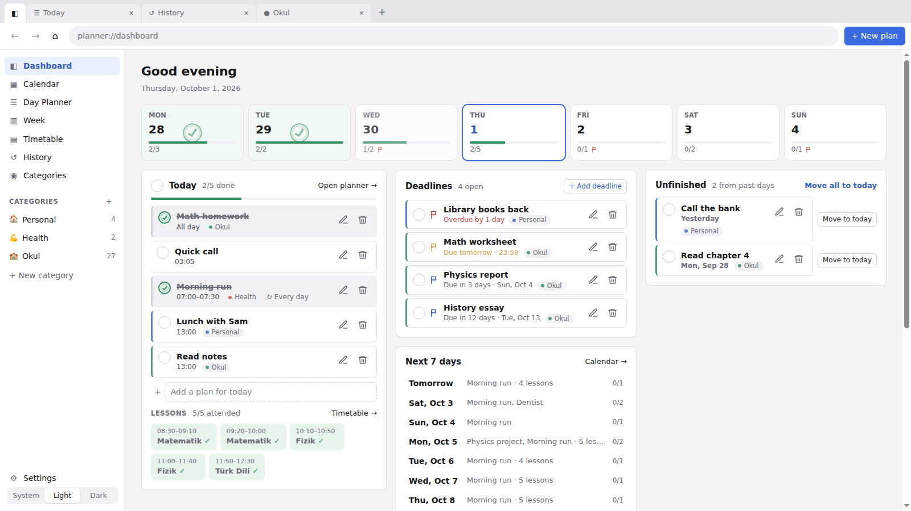
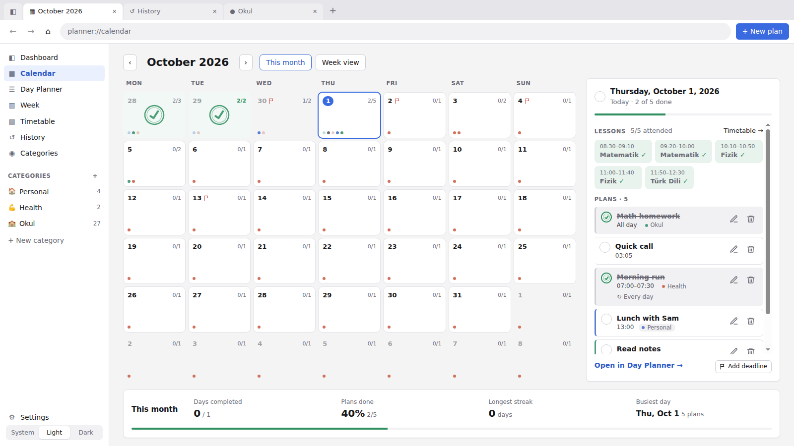
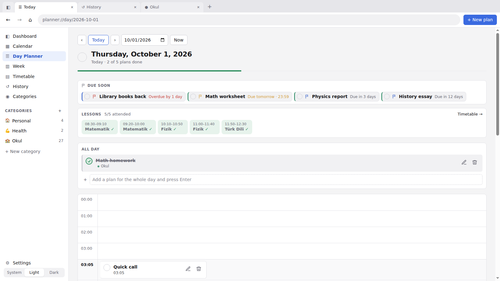
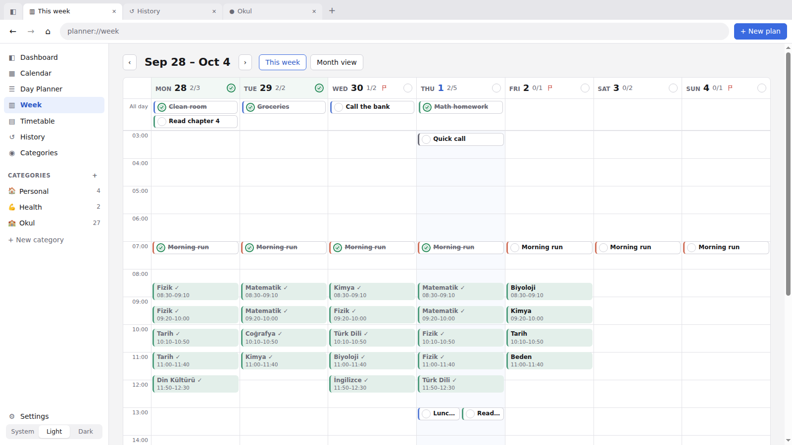
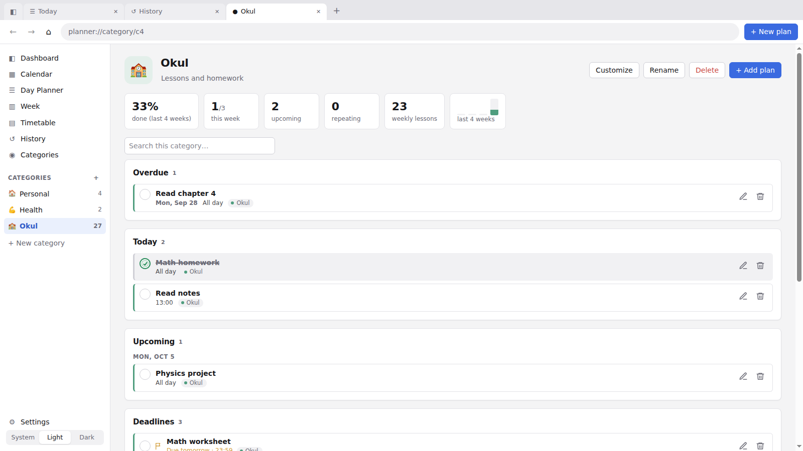
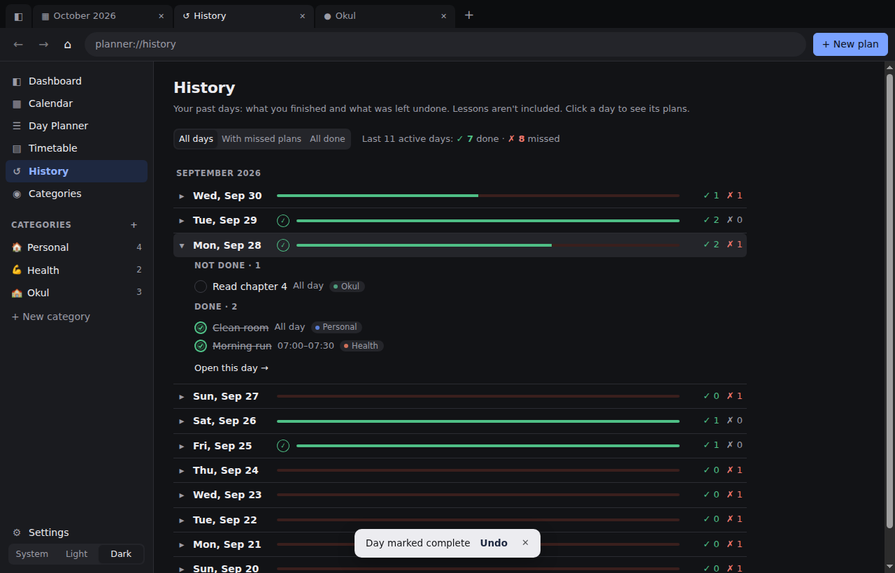
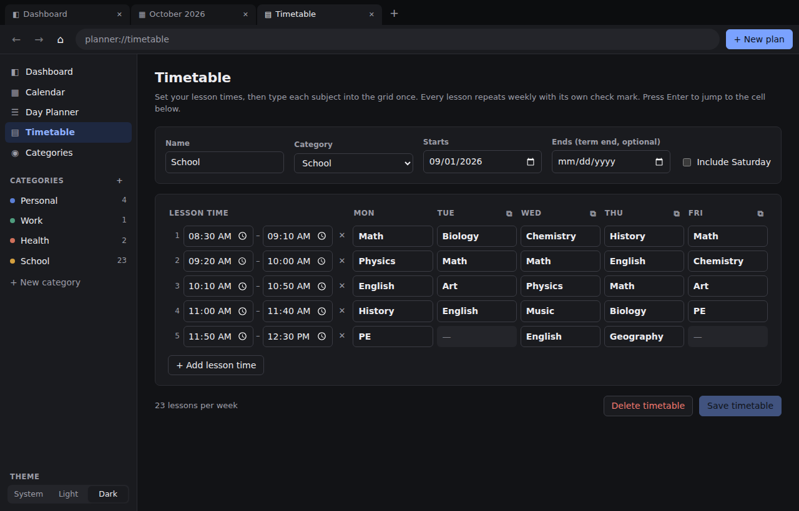

# Planning-App

A desktop planning app made by AI to help me plan things. It navigates like a browser, with tabs, back/forward buttons and an address bar, but it only moves between its own pages. It never loads websites.

Built with **Electron + React** (bundled by Vite). All data is saved locally in a single JSON file.



## Download and install

1. Open the **[Releases page](https://github.com/Berkaykay/Planning-App/releases/latest)**. On the repository's main page it's under **Releases** on the right.
2. Under **Assets**, download the file for your computer:

| Your computer | File to download |
| --- | --- |
| Windows | `Planner-Setup-<version>.exe` (installs the app), or `Planner-Portable-<version>.exe` (runs without installing) |
| Mac with Apple Silicon (M1/M2/M3/M4) | `Planner-<version>-mac-arm64.dmg` |
| Mac with Intel processor | `Planner-<version>-mac-x64.dmg` |
| Linux | `Planner-<version>-linux.AppImage` |

3. Open it:
   - **Windows:** double-click the Setup file. It installs in a few seconds and adds a **Planner** shortcut to your desktop and Start menu. The app isn't code-signed, so Windows may show *"Windows protected your PC"*: click **More info** → **Run anyway**.
   - **macOS:** open the `.dmg` and drag **Planner** into **Applications**. The first time you open it, macOS will say it can't verify the developer. Click **Done**, then go to **System Settings → Privacy & Security** and click **Open Anyway**. If macOS says the app *"is damaged"*, run `xattr -cr /Applications/Planner.app` in Terminal and open it again.
   - **Linux:** make the file executable (`chmod +x Planner-*.AppImage`) and run it. On Ubuntu 22.04 and newer, if it doesn't start, install FUSE (`sudo apt install libfuse2t64`, or `libfuse2` on 22.04) or start it with `--no-sandbox`.

**Updating is automatic for your data:** your plans are stored separately from the app, so a new version picks them up as they are. Just replace the old file (or run the new installer). See [Where your data is stored](#where-your-data-is-stored).

### Run from source (for developers)

Requirements: [Node.js](https://nodejs.org/) 20 or newer (includes `npm`).

```bash
npm install     # first time only; downloads Electron
npm start       # builds the UI and opens the app window
npm run dev     # same, with instant reload of UI changes
npm run dist    # builds an installer for your OS into release/
```

### How releases are made

The [Build installers](.github/workflows/build.yml) GitHub Action builds and tests the Windows, macOS and Linux versions on every push. On pushes to `main`, it also publishes them on the Releases page as version `v<version>` from `package.json`. To publish a new version, raise `"version"` in `package.json` (for example `1.0.0` → `1.1.0`) and push to `main`. If you push without changing the version, the files in the existing release are replaced.

## Features

**Browser-style navigation**
- Tabs: `+` or **Ctrl+T** opens a tab, **Ctrl+W** or middle-click closes one, **Ctrl+Shift+T** reopens the last closed tab, and **Ctrl+Tab** / **Ctrl+Shift+Tab** switches between them.
- Drag a tab along the tab strip to reorder it; the other tabs slide out of the way.
- Right-click a tab for more options: *New tab to the right*, *Duplicate*, *Pin* (pinned tabs shrink to an icon and stay on the left), *Close other tabs*, *Close tabs to the right* and *Reopen closed tab*.
- Each tab has its own back/forward history. Use the ← → buttons, **Alt+←/→** (on macOS **Cmd+[ / ]**), or the mouse side buttons.
- The address bar shows the page you're on, such as `planner://day/2026-10-01`, and you can type an address to go there. Addresses: `planner://dashboard`, `planner://calendar/2026-10` (or `planner://calendar/2026-10-01` to select a day), `planner://day/today`, `planner://timetable`, `planner://categories`.
- **Ctrl+click** or middle-click any link or calendar day to open it in a background tab.
- **Ctrl+1–4** jump to Dashboard, Calendar, today's Day Planner and Categories. **Ctrl+L** focuses the address bar.
- Your open tabs, their order and their history are restored when you reopen the app.

**Pages**
- **Dashboard**: a *This week* strip (Monday to Sunday with each day's progress, stamps on completed days and deadline flags; click a day to open it), today's plans and lessons, *Up next* (the next lesson and plan with a countdown), your *Deadlines*, the next 7 days, *Your progress* (streak of completed days, plans done this week and this month, lessons attended), *Unfinished* plans from recent days (with **Move to today**), a two-week history for each routine, and your categories as tiles.
- **Calendar**: a month grid that grows with the window. Each day shows one dot per plan (in its category color) and a done/total count, and completed days get a green stamp. Click a day to see it in the panel beside the calendar, where its plans stay in time order (checking one crosses it out in place, so nothing jumps). From there you can check off plans, add plans and complete the whole day without leaving the page. You can also drag a plan onto another day to move it there. Days with a deadline show a small flag. Double-click a day to open it in the Day Planner. A **This month** bar along the bottom shows days completed, the share of plans done, your longest streak of completed days and your busiest day.
- **Day Planner**: an *All day* section plus 24 hourly slots on one scrolling page. It opens at the top; on today, **Now** scrolls to the current hour. Plans at the same time sit side by side, and a plan that starts between hours (say 03:05) gets its own 03:05 line under 03:00. Click a slot (or **+ New plan**) to schedule something at that time. A *Due soon* bar at the top lists deadlines still ahead. Drag plans between hours or into *All day* to move them. While dragging you can scroll with the mouse wheel, and the page also scrolls by itself near the top or bottom edge.
- **Week**: Monday to Sunday side by side with an hour scale. It shows your lessons and plans as blocks sized by how long they take. Click an empty slot to add a plan there, or drag a plan to another day or hour.
- **Timetable**: your weekly school (or work) schedule, set up once. See [Timetable](#timetable) below.
- **History**: a compact record of your past days. Each day is one line (✓ done · ✗ missed); click it to see exactly which plans were done and which weren't. Filter to days with missed plans or days where everything was done, and load older days as needed.
- **Settings**: theme, reminders, backups and where your data is stored.
- **Categories**: create, rename, recolor and delete categories. Each category has its own page with:
  - an icon (emoji), a description and any color, set under **Customize**;
  - stats: % done over the last 4 weeks, this week's progress, upcoming and repeating plans, and a 4-week chart;
  - everything in the category on one page, in sections: *Overdue*, *Today*, *Upcoming* (grouped by day), *Deadlines*, *Repeating*, *Lessons* (as a small weekly timetable) and *Done* (folded away; click to open). The search box filters every section.

**Categories sidebar**: create (`+`), rename (✎ or double-click), delete (🗑), and select (click) categories. Assign a plan to a category in the plan dialog, or drag a plan onto a category in the sidebar. Deleting a category keeps its plans; they just have no category any more.

**Plans**: each plan has a title, date, a start and optional end time such as 08:30–09:10 (or *All day*), a category, notes and an optional repeat. Edit with the pencil button (or double-click), delete with the trash button, and move by dragging or by changing the date and time in the edit dialog.

**Check marks**
- Each plan has a round check button. Checking it presses in a green stamp, and the plan is crossed out. Clicking again undoes it.
- Each whole day also has its own check button: the big circle next to the date in the Day Planner, on the Dashboard's *Today* card, or in the Calendar's day panel. A completed day's heading is crossed out and highlighted.
- Days and plans stay in step:
  - checking a day checks all of its plans, and unchecking it unchecks them;
  - checking the last open plan completes the day, and unchecking a plan reopens it.

  (Lessons don't count; see below.)
- **Checklists:** a plan can have sub-tasks (add them in the plan dialog under *Checklist*). The plan shows e.g. ☑ 2/5; click it to tick items off. Ticking the last item completes the plan.

**Repeating plans**: set *Repeat* to Daily, Weekly (on chosen weekdays) or Monthly (same date; a plan on the 31st falls on the last day of shorter months), with an optional end date.
- A repeating plan is never removed when you finish it. Each occurrence has its own check mark, so when the day (or week, or month) comes around again it starts unchecked.
- Past check marks are kept as history. The Dashboard and category pages show a two-week tracker and your current streak.
- When editing, moving or deleting a repeating plan, you choose between *only this day* and *all occurrences*.

**Deadlines**: for things that must be done *by* a day rather than *on* it, such as homework. Right-click a day in the Calendar or Week view and choose **Add deadline…**, use **Add deadline** in the Calendar's day panel, or **+ Add deadline** on the Dashboard. A deadline has a title, a due date, an optional time, a category and notes, and you can edit or move it at any time.
- The Dashboard lists open deadlines with a countdown (*Due in 3 days*, *Due tomorrow*, *Overdue by 1 day*), colored as the date gets close.
- It shows in the Day Planner's *Due soon* bar every day until it's due, as a flag on its day in the Calendar, Week view and This-week strip, and in its category's page.
- Check it off when you're done; Ctrl+Z brings it back.
- With reminders on, you get a notification the day before and on the day it's due.

### Timetable

For school lessons (or any fixed weekly schedule), open **Timetable** in the sidebar:

1. Check the **lesson times** on the left. Five 40-minute lessons from 08:30 are filled in to start with. Change the times, **+ Add lesson time** (it continues from the last lesson), or remove a row with ✕.
2. Type each subject into the **Mon–Fri grid**. Press **Enter** to jump to the cell below, and subjects you've typed before are suggested. The ⧉ button next to a day copies the previous day's lessons. Tick **Include Saturday** if you have Saturday lessons.
3. Optionally set when the term **ends**, then click **Save timetable**.

Each filled cell becomes a weekly lesson in the *School* category, created automatically. Lessons aren't counted as plans: they appear in their own **Lessons** strip on the Day Planner, Dashboard and Calendar, with their times (such as 08:30–09:10). Lessons tick themselves once they're over, so you don't have to check them one by one. If you skipped one, click it (or right-click → *Mark absent*); this doesn't change your plan progress. The category's sidebar count and its Dashboard tile include its lessons. You can come back and change the timetable at any time: saving again updates your lessons but keeps the check marks you already made. **Delete timetable** removes all its lessons.

**Theme**: the switch at the bottom of the sidebar chooses **Light**, **Dark** or **System** (follows your computer's setting).

**Right-click menus**:
- **Plans:** done/not done, edit, duplicate, copy to tomorrow / to a date / to every day this week, move to today / tomorrow, change category, delete, undo.
- **Calendar and week days:** open, open in a new tab, add a plan, add a deadline, mark the day complete.
- **Lessons:** attended / absent.
- **Categories in the sidebar:** open in a new tab, rename, customize, delete.
- **Tabs:** see above.
- **Text fields:** cut, copy, paste.

**Undo**: **Ctrl+Z** undoes the last change to your plans, such as completing, deleting, moving or importing, and **Ctrl+Shift+Z** (or **Ctrl+Y**) redoes it. *Undo* is also in the right-click menus.

**Reminders**: Planner shows a desktop notification 10 minutes before a timed plan starts, while the app is open. In **Settings** you can turn reminders off, change the timing, or include lessons.

## Where your data is stored

Everything is saved immediately after each change to `planner-data.json` in the app's data folder:

| OS      | Location                                        |
| ------- | ----------------------------------------------- |
| Windows | `%APPDATA%\Planner\planner-data.json`           |
| macOS   | `~/Library/Application Support/Planner/planner-data.json` |
| Linux   | `~/.config/Planner/planner-data.json`           |

- **Updates keep your data:** the file lives outside the app, so new versions simply keep using it.
- **Daily backups:** each day the app starts, it saves a copy in the `backups` folder next to the data file and keeps the last 7 days.
- **Export/Import:** **Settings → Export backup…** saves everything to a file of your choice; **Import backup…** loads one back (and can be undone with Ctrl+Z).
- **Safe with older versions:** if an older version of Planner opens data saved by a newer one, it shows it but doesn't overwrite it.
- **Crash-safe writes:** the app writes a temporary file and then renames it, so a crash can't corrupt your data.

To use a different folder, set the `PLANNER_DATA_DIR` environment variable.

## Tests

```bash
npm test             # unit tests + end-to-end tests
npm run test:unit    # date/recurrence/state logic (node:test)
npm run test:e2e     # drives the real Electron app with Playwright
```

The end-to-end tests launch the actual app with a temporary data folder and cover:
- creating, renaming, selecting and deleting categories;
- adding, completing, undoing, editing, dragging, moving and deleting daily and hourly plans;
- whole-day completion and undo;
- the Timetable: entering lessons, weekly repeats, editing without losing check marks, and deleting;
- the Calendar's day panel and month stats;
- the **+ New plan** button on every page;
- lessons kept apart from plans, the History page, unfinished plans, category customization, filters and stats;
- day ↔ plan check marks staying in step, lessons ticking themselves, checklists, the week view, right-click menus, and dragging plans while scrolling and between days;
- undo/redo, reminders, backup export/import, daily backups and the newer-version guard;
- repeating plans: a fresh check mark each day, history, and one-day edits and deletes;
- tabs (dragging, pinning, the right-click menu, reopening closed tabs), back/forward, the address bar and keyboard shortcuts;
- persistence across closing and reopening the app, including the theme and tab order.

On a Linux machine without a display (for example CI), run them under a virtual display: `xvfb-run -a npm run test:e2e`.

## Project layout

```
electron/        main process: window, menu/shortcuts, JSON storage (storage.cjs), preload bridge
src/lib/         pure logic: dates, recurrence rules, routes, state reducer, undo history
src/components/  tabs, nav bar, sidebar, plan item, dialogs, shared plan/category actions
src/pages/       Dashboard, Calendar, DayPlanner, Week, Timetable, History, Categories, CategoryPage, Settings, NotFound
tests/unit/      node:test unit tests
tests/e2e/       Playwright tests against the Electron app
```







